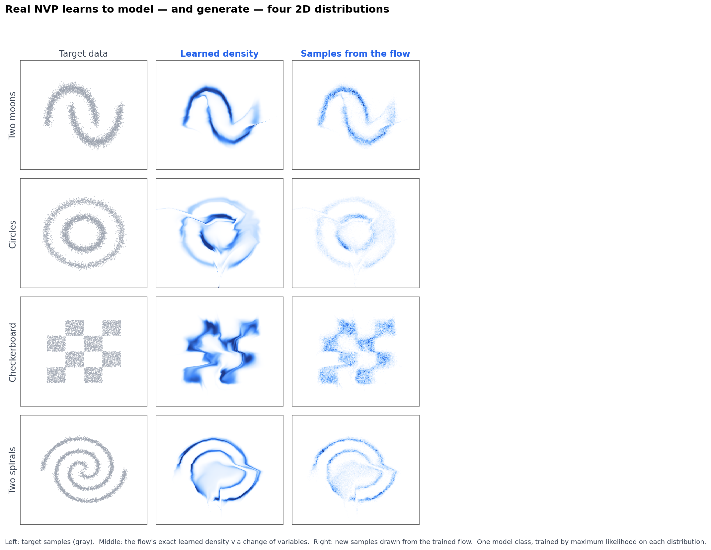
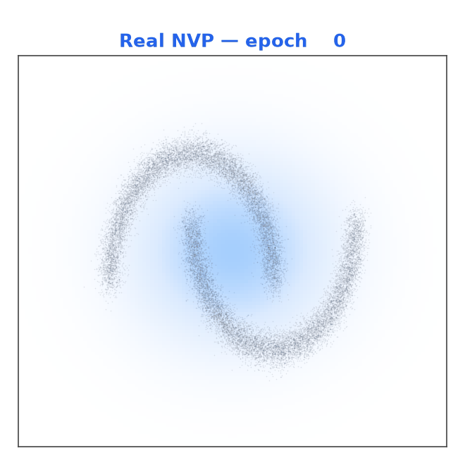
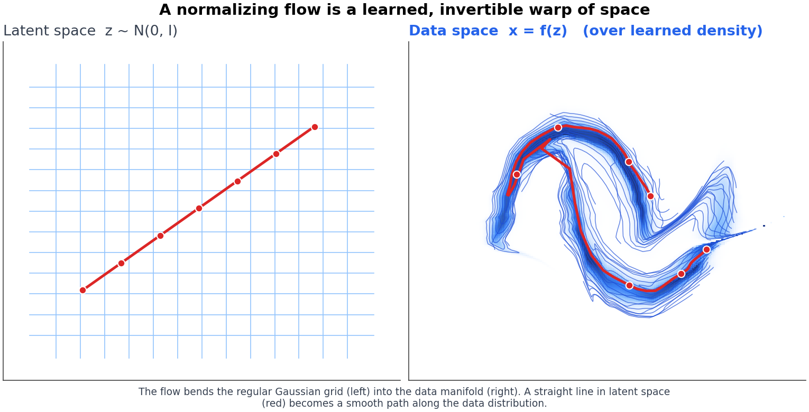
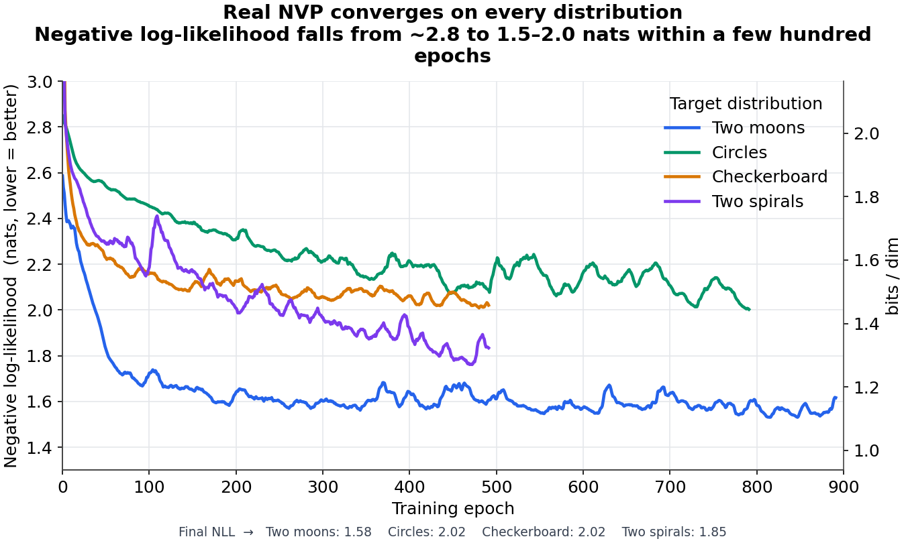
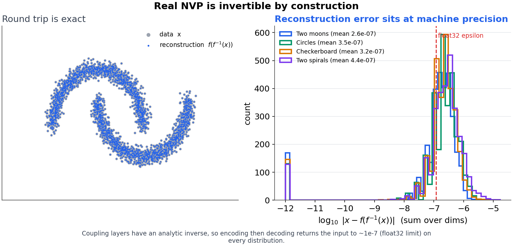
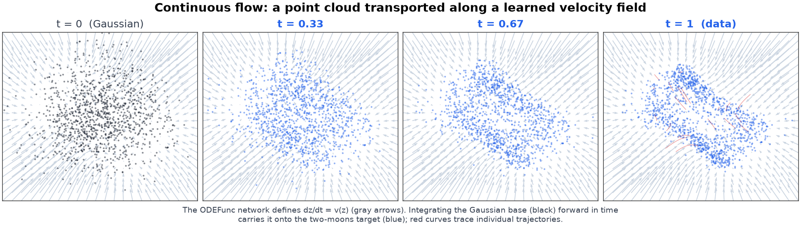
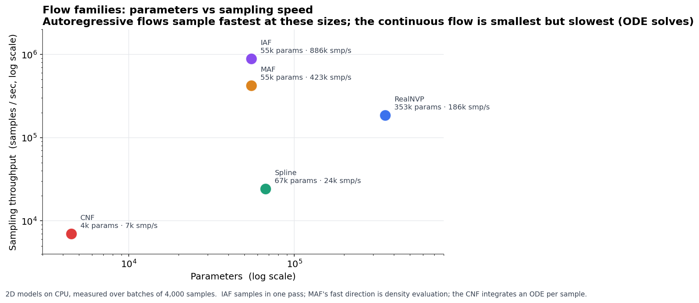

# Normalizing Flows — A Study Implementation

A from-scratch, PyTorch implementation of normalizing flows for density estimation and generative modeling, spanning coupling, autoregressive, spline, continuous (CNF), and residual flow families — with a visualization toolkit, diagnostics, and tutorial notebooks.

[](https://github.com/itxtx/normalizing-flows-study/actions/workflows/ci.yml)


<p align="center">
  
  <br>
  <em>One model class (Real NVP), trained by maximum likelihood, learning to model and generate four 2D distributions.</em>
</p>

---

## What is this?

A normalizing flow models a complex distribution $p_X(\mathbf{x})$ by learning an invertible map $f$ from a simple base distribution (a Gaussian) to the data. Because $f$ is invertible with a tractable Jacobian, you get **exact** likelihoods via the change-of-variables formula:

$$\log p_X(\mathbf{x}) = \log p_Z\big(f^{-1}(\mathbf{x})\big) + \log\left|\det \frac{\partial f^{-1}}{\partial \mathbf{x}}\right|$$

This repo implements the major flow families behind that idea, each as a small, readable `nn.Module`, and builds them up into trainable models. It is meant as a study/reference codebase: every layer is documented and covered by correctness tests (invertibility, log-det vs. autodiff, gradient checks).

## Results

**Training a flow, live.** A Real NVP density tightening onto the two-moons target over training epochs:

<p align="center">
  
</p>

**A flow is a learned, invertible warp of space.** The Gaussian latent grid (left) is bent onto the data manifold (right); a straight line in latent space becomes a smooth interpolation path along the data:

<p align="center">
  
</p>

**Convergence and invertibility.**

<p align="center">
  
</p>

<p align="center">

</p>

**Continuous flows and a speed/size comparison.** Left: a point cloud transported along the learned ODE velocity field from Gaussian to data. Right: parameters vs. sampling throughput across flow families.

<p align="center">
  
</p>

<p align="center">
  
</p>

All figures are reproducible from `plots/` (see [Figures](#figures)).

## Implemented flows

| Family | Implementations | Reference |
| --- | --- | --- |
| **Coupling** | `CouplingLayer`, `RealNVP`, `SplineCouplingLayer`, `RealNVPSpline` | Dinh et al. (2017), *Density estimation using Real NVP* |
| **Autoregressive** | `MADE`, `MaskedAutoregressiveFlow` (MAF), `InverseAutoregressiveFlow` (IAF) | Germain et al. (2015); Papamakarios et al. (2017); Kingma et al. (2016) |
| **Neural spline** | `rational_quadratic_spline`, `ARQS` | Durkan et al. (2019), *Neural Spline Flows* |
| **Continuous (CNF)** | `ODEFunc`, `ContinuousFlow`, `DynamicODEFunc`, `ODEtODElFlow` | Chen et al. (2018); Grathwohl et al. (2019), *FFJORD* |
| **Planar / Radial** | `planar_flow`, `radial_flow` | Rezende & Mohamed (2015) |
| **Sylvester** | `sylvester_flow` | van den Berg et al. (2018) |
| **Residual** | `residual_flow` | Behrmann et al. (2019); Chen et al. (2019) |
| **Neural autoregressive** | `neural_autoregressive_flow` | Huang et al. (2018) |
| **Experimental** | `FlowMatchingFlow`, `ShortcutFlow`, `ConsistencyFlow`, `GuidedFlow`, `TarFlow`, transformer blocks | recent flow-matching / consistency literature |

Models are assembled from these layers in `src/models/` (`NormalizingFlowModel`, `RealNVP`, `RealNVPSpline`).

## Installation

```bash
git clone https://github.com/itxtx/normalizing-flows-study.git
cd normalizing-flows-study

python -m venv venv && source venv/bin/activate   # optional
pip install -e ".[viz,dev]"                        # editable install + extras
```

`-e .` installs the package (importable as `src`), `viz` adds Plotly for interactive plots, and `dev` adds pytest. For a plain dependency install you can also use `pip install -r requirements.txt`.

## Quickstart

Train a Real NVP on the two-moons distribution and draw samples:

```python
import torch
from torch.distributions import MultivariateNormal
from src.models import RealNVP
from src.utils import get_two_moons_data

device = "cuda" if torch.cuda.is_available() else "cpu"

# 2D data and a standard-Gaussian base distribution
data = get_two_moons_data(n_samples=5000, noise=0.05).to(device)
base = MultivariateNormal(torch.zeros(2, device=device), torch.eye(2, device=device))

# 8 coupling layers (must be even so every dimension gets transformed)
model = RealNVP(data_dim=2, n_layers=8, hidden_dim=64).to(device)
opt = torch.optim.Adam(model.parameters(), lr=1e-3)

for epoch in range(2000):
    z, log_det = model.inverse(data)               # data -> latent
    loss = -(base.log_prob(z) + log_det).mean()    # negative log-likelihood
    opt.zero_grad()
    loss.backward()
    opt.step()
    if epoch % 200 == 0:
        print(f"epoch {epoch:4d}  nll {loss.item():.3f}")

# Sample from the trained model: latent -> data
z = base.sample((5000,))
samples, _ = model.forward(z)
```

Every flow follows the same contract: `inverse(x) -> (z, log_det)` maps data to latent for likelihood, and `forward(z) -> (x, log_det)` maps latent to data for sampling.

## Visualization & diagnostics

`src/visualization/` provides tooling to inspect what a flow has learned:

- **`FlowVisualizer`** — 2D transformation plots, density-evolution animation through layers, and interactive Plotly views.
- **`JacobianAnalyzer`** — inspect the Jacobian / log-det behavior of a trained flow.
- **`FlowDiagnostics`** — automated checks (invertibility, sample quality, numerical stability) returning structured reports.

See `examples/visualization_demo.py` for an end-to-end demo.

## Notebooks

Tutorial notebooks in `notebooks/` build the theory up from scratch:

1. `1_Basics_Coupling_Flow.ipynb` — change of variables, log-likelihood, coupling flows
2. `2_Autoregressive_Flows.ipynb` — MADE, MAF, IAF
3. `3_Continous_flows.ipynb` — continuous / ODE-based flows
4. `4_Neural_Spline_Flows.ipynb` — rational-quadratic spline flows

## Project structure

```
src/
  flows/            # flow layers, grouped by family
    coupling/  autoregressive/  spline/  continuous/  advanced/
    optimization/   # mixed precision, gradient checkpointing, CUDA kernels
    utils/          # memory + profiling helpers
  models/           # RealNVP, RealNVPSpline, NormalizingFlowModel
  training/         # learning-rate schedulers
  visualization/    # FlowVisualizer, JacobianAnalyzer, FlowDiagnostics
tests/              # unit + correctness tests (invertibility, log-det, gradcheck)
notebooks/          # tutorial notebooks
examples/           # runnable demos
plots/              # scripts that regenerate every figure in this README
assets/             # figures used in this README
```

## Testing

```bash
pip install -e ".[dev]"
pytest                      # full suite
pytest tests/correctness    # invertibility, log-det vs. autodiff, gradient checks
```

## Figures

Every figure above is regenerated by a script in `plots/`. Models are trained once and cached to `plots/_cache/`:

```bash
pip install -e ".[viz,dev]"
python plots/make_cache.py gallery moons:all   # train + cache the flows
python plots/fig_gallery.py                     # hero gallery
python plots/fig_curves.py                       # training curves + bits/dim
python plots/fig_gif.py                          # training-progress GIF
python plots/fig_interp.py                        # latent-space warp
python plots/fig_recon.py                         # invertibility / reconstruction error
python plots/fig_cnf.py                           # continuous-flow trajectories
python plots/fig_benchmark.py                     # params vs sampling throughput
```

## Known issues / good first fixes

Building the figures surfaced a few real bugs — useful entry points for contributors:

- **Continuous flow can't learn a density.** `ODEFunc` hard-codes the log-determinant dynamics to zero (`trace_approx = torch.zeros(...)`), so maximum-likelihood CNF training collapses to the trivial solution. It needs a proper divergence estimate (exact trace for 2D, or Hutchinson's estimator). The continuous-flow figure here trains the velocity field with a flow-matching objective to work around this.
- **MAF/IAF densities blow up in eval mode.** The MADE conditioner uses `BatchNorm1d`, whose running statistics are miscalibrated after full-batch training, so eval-mode density evaluation explodes. Recalibrating the running stats (or switching to a flow-friendly normalization) fixes it.
- **Spline coupling produces non-invertible, spiky densities.** `RealNVPSpline` round-trips with large reconstruction error and density spikes (~1e12), pointing to a bin/tail handling bug in the rational-quadratic spline.

Real NVP is numerically solid (bit-exact invertibility, calibrated likelihoods), which is why it anchors most figures.

## References

- Rezende & Mohamed (2015). *Variational Inference with Normalizing Flows.*
- Dinh, Sohl-Dickstein & Bengio (2017). *Density Estimation using Real NVP.*
- Papamakarios, Pavlakou & Murray (2017). *Masked Autoregressive Flow for Density Estimation.*
- Kingma et al. (2016). *Improving Variational Inference with Inverse Autoregressive Flow.*
- Durkan, Bekasov, Murray & Papamakarios (2019). *Neural Spline Flows.*
- Grathwohl et al. (2019). *FFJORD: Free-form Continuous Dynamics for Scalable Reversible Generative Models.*
- Papamakarios et al. (2021). *Normalizing Flows for Probabilistic Modeling and Inference* (survey).
