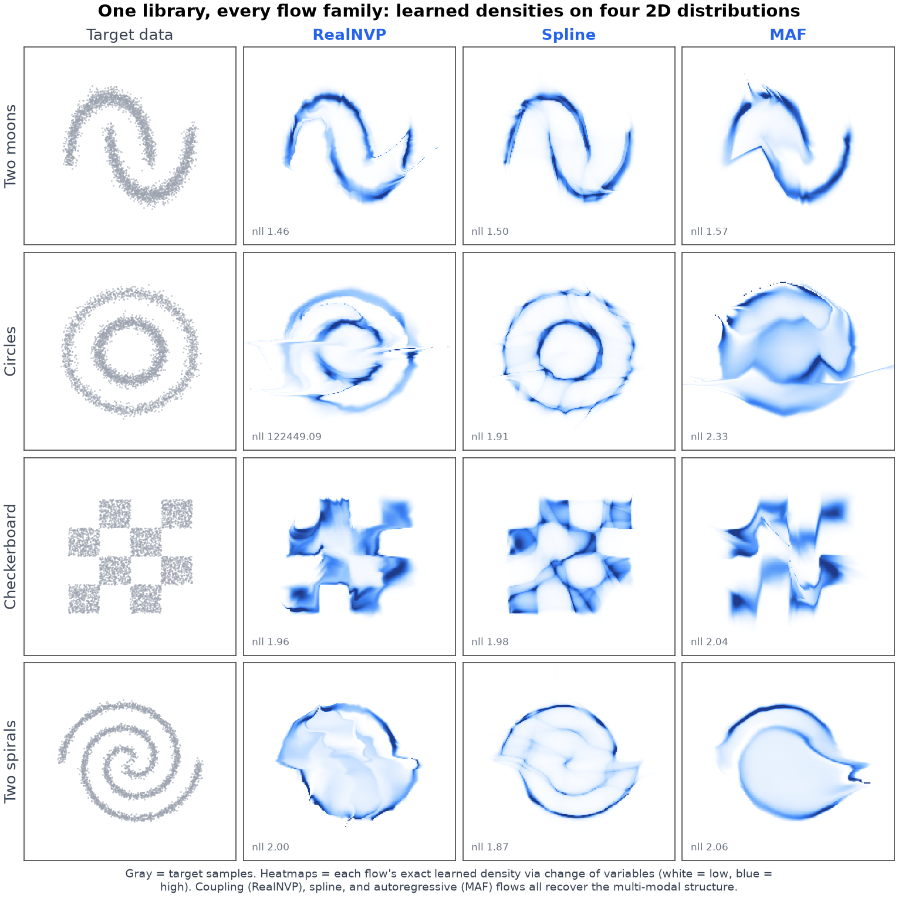
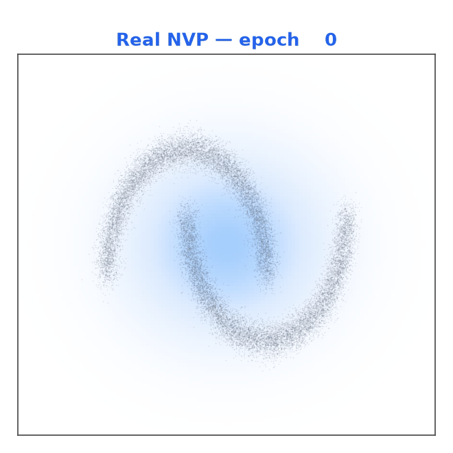
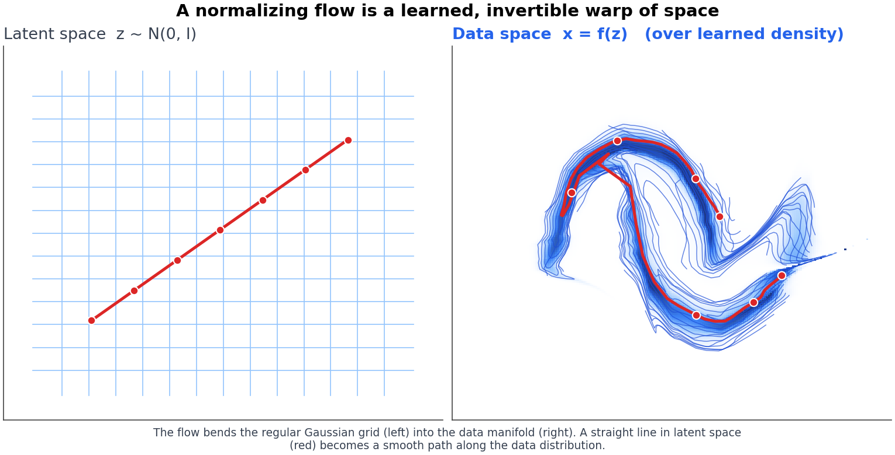
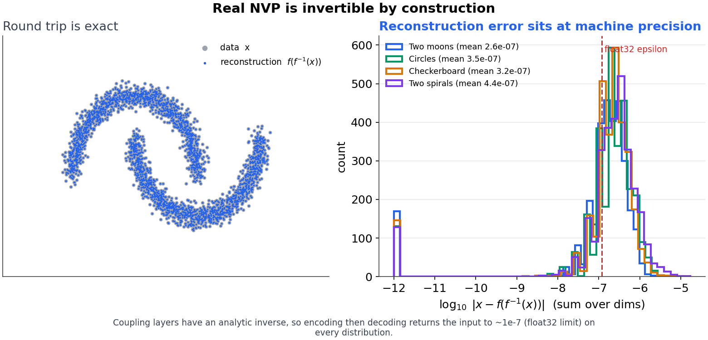
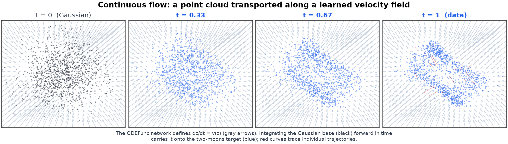
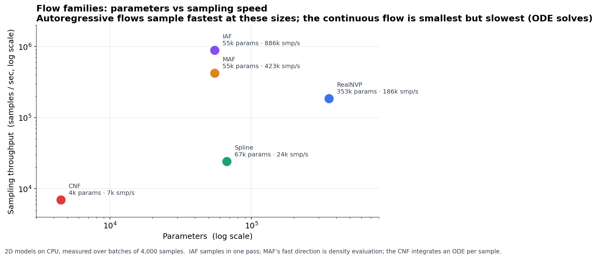
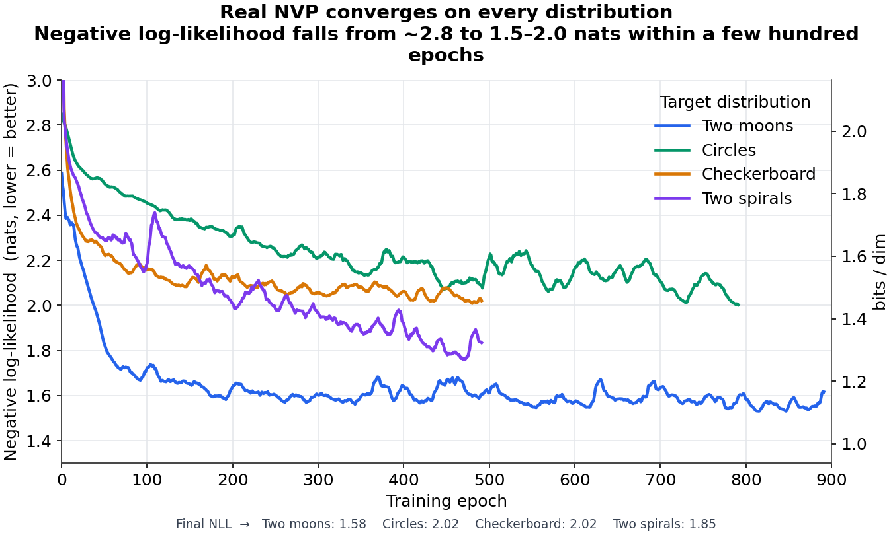

# Normalizing Flows

A from-scratch, PyTorch implementation of normalizing flows for density estimation and generative modeling, spanning coupling, autoregressive, spline, and continuous (CNF) flow families — with a visualization toolkit, diagnostics, and tutorial notebooks.

[](https://github.com/itxtx/normalizing-flows-study/actions/workflows/ci.yml)


<p align="center">
  
  <br>
  <em>Coupling (RealNVP), spline, and autoregressive (MAF) flows, each trained by maximum likelihood, learning four 2D distributions.</em>
</p>

---

## What is this?

A normalizing flow models a complex distribution $p_X(\mathbf{x})$ by learning an invertible map $f$ from a simple base distribution (a Gaussian) to the data. For discrete flows with a tractable Jacobian, this gives exact likelihoods via the change-of-variables formula:

$$\log p_X(\mathbf{x}) = \log p_Z\big(f^{-1}(\mathbf{x})\big) + \log\left|\det \frac{\partial f^{-1}}{\partial \mathbf{x}}\right|$$

This repo focuses on likelihood-based normalizing flows rather than the broader family of flow-matching, consistency, or guided generative methods. Core transforms are small, readable `nn.Module` implementations backed by correctness tests for invertibility, log-determinants, gradients, and numerical stability. Continuous flows use numerical ODE integration, so their accuracy also depends on the integration and trace-estimation settings.

## Results

**Training a flow, live.** A Real NVP density tightening onto the two-moons target over training epochs:

<p align="center">
  
</p>

**A flow is a learned, invertible warp of space.** The Gaussian latent grid (left) is bent onto the data manifold (right); a straight line in latent space becomes a smooth interpolation path along the data:

<p align="center">
  
</p>

**Invertibility.**

<p align="center">

</p>

**Continuous flow.** A maximum-likelihood-trained CNF transports the Gaussian base along its learned ODE velocity field onto the two-moons target:

<p align="center">
  
</p>

**How the families compare.** Test NLL vs. parameter count on two-moons, with marker size encoding sampling throughput:

<p align="center">
  
</p>

**Convergence.** Real NVP negative log-likelihood vs. epoch on each distribution (with a bits/dim axis):

<p align="center">
  
</p>

All figures are reproducible from `plots/` (see [Figures](#figures)).

## Scope and implemented flows

| Status | Family | Implementations | Contract |
| --- | --- | --- | --- |
| **Core** | Composition | `Flow`, `SequentialFlow`, `Permutation` | Shared bidirectional interface |
| **Core** | Coupling | `CouplingLayer`, `RealNVP` | Exact discrete transform |
| **Core** | Autoregressive | `MADE`, MAF, IAF | Exact discrete transform; likelihood/sampling speed trade-off |
| **Core** | Neural spline | `rational_quadratic_spline`, `SplineCouplingLayer`, `RealNVPSpline`, `ARQS` | Exact discrete transform up to numerical precision |
| **Core, numerical** | Continuous | `ODEFunc`, `ContinuousFlow` | Numerical ODE integration; estimated trace above two dimensions |
| **Advanced study** | Classical variational | Planar, radial, and Sylvester flows | Forward-oriented study implementations; not part of the supported bidirectional public API |
| **Advanced study** | Deep affine autoregressive | `NeuralAutoregressiveFlow` | Experimental MADE-based implementation; not exported from `src.flows` |

The supported public layers are exported from `src.flows`. Canonical models are assembled in `src/models/` (`NormalizingFlowModel`, `RealNVP`, `RealNVPSpline`, `MAF`, `IAF`). The autoregressive model builders mix feature order between layers by default. Code under `src/flows/advanced/` is retained for focused study and does not yet promise the same bidirectional contract as the core package.

## Installation

```bash
git clone https://github.com/itxtx/normalizing-flows-study.git
cd normalizing-flows-study

python -m venv venv && source venv/bin/activate   # optional
pip install -e ".[viz,dev]"                        # editable install + extras
```

`-e .` installs the package (importable as `src`), `viz` adds Plotly for interactive plots, and `dev` adds pytest. For a plain dependency install you can also use `pip install -r requirements.txt`.

## Quickstart

Train a Real NVP on the two-moons distribution and draw samples:

```python
import torch
from torch.distributions import MultivariateNormal
from src.models import RealNVP
from src.utils import get_two_moons_data

device = "cuda" if torch.cuda.is_available() else "cpu"

# 2D data and a standard-Gaussian base distribution
data = get_two_moons_data(n_samples=5000, noise=0.05).to(device)
base = MultivariateNormal(torch.zeros(2, device=device), torch.eye(2, device=device))

# 8 coupling layers (must be even so every dimension gets transformed)
model = RealNVP(data_dim=2, n_layers=8, hidden_dim=64).to(device)
opt = torch.optim.Adam(model.parameters(), lr=1e-3)

for epoch in range(2000):
    z, log_det = model.inverse(data)               # data -> latent
    loss = -(base.log_prob(z) + log_det).mean()    # negative log-likelihood
    opt.zero_grad()
    loss.backward()
    opt.step()
    if epoch % 200 == 0:
        print(f"epoch {epoch:4d}  nll {loss.item():.3f}")

# Sample from the trained model: latent -> data
z = base.sample((5000,))
samples, _ = model.forward(z)
```

Core flows follow the same interface: `inverse(x) -> (z, log_det)` maps data to latent for likelihood, and `forward(z) -> (x, log_det)` maps latent to data for sampling. `ContinuousFlow` exposes the same interface through numerical integration. Advanced study implementations may have a narrower or approximate contract.

## Visualization & diagnostics

`src/visualization/` provides tooling to inspect what a flow has learned:

- **`FlowVisualizer`** — 2D transformation plots, density-evolution animation through layers, and interactive Plotly views.
- **`JacobianAnalyzer`** — inspect the Jacobian / log-det behavior of a trained flow.
- **`FlowDiagnostics`** — automated checks (invertibility, sample quality, numerical stability) returning structured reports.

See `examples/visualization_demo.py` for an end-to-end demo.

## Notebooks

The notebooks are compact, reproducible tutorials with explicit goals, bounded training defaults, visual inspection, numerical contract checks, and suggested follow-up experiments. They are executed during notebook maintenance but are not part of the regular pytest suite.

1. [`1_Basics_Coupling_Flow.ipynb`](notebooks/1_Basics_Coupling_Flow.ipynb) — change of variables, log-likelihood, coupling flows
2. [`2_Autoregressive_Flows.ipynb`](notebooks/2_Autoregressive_Flows.ipynb) — MADE, MAF, IAF
3. [`3_Continuous_Flows.ipynb`](notebooks/3_Continuous_Flows.ipynb) — continuous / ODE-based flows
4. [`4_Neural_Spline_Flows.ipynb`](notebooks/4_Neural_Spline_Flows.ipynb) — rational-quadratic spline flows

For exhaustive API and numerical guarantees, treat `tests/` and the reproducible scripts in `plots/` as the source of truth; the notebooks prioritize explanation and interactive experimentation.

## Project structure

```
src/
  flows/            # flow layers, grouped by family
    coupling/  autoregressive/  spline/  continuous/
    advanced/       # forward-oriented or experimental study implementations
    optimization/   # mixed precision, gradient checkpointing, CUDA kernels
    utils/          # memory + profiling helpers
  models/           # canonical RealNVP, spline, MAF, and IAF models
  training/         # learning-rate schedulers
  visualization/    # FlowVisualizer, JacobianAnalyzer, FlowDiagnostics
tests/              # unit + correctness tests (invertibility, log-det, gradcheck)
notebooks/          # tutorial notebooks
examples/           # runnable demos
plots/              # scripts that regenerate every figure in this README
assets/             # figures used in this README
```

## Testing

```bash
pip install -e ".[dev]"
pytest                      # full suite
pytest tests/correctness    # invertibility, log-det vs. autodiff, gradient checks
```

## Figures

Every figure above is regenerated by a script in `plots/`. Models are trained once and cached to `plots/_cache/`:

```bash
pip install -e ".[viz,dev]"
python plots/make_cache.py gallery moons:all   # train + cache the flows
python plots/fig_gallery.py                     # hero gallery
python plots/fig_curves.py                       # training curves + bits/dim
python plots/fig_gif.py                          # training-progress GIF
python plots/fig_interp.py                        # latent-space warp
python plots/fig_recon.py                         # invertibility / reconstruction error
python plots/fig_cnf.py                           # continuous-flow trajectories
python plots/fig_benchmark.py                     # params vs sampling throughput
```


## References

- Rezende & Mohamed (2015). *Variational Inference with Normalizing Flows.*
- Dinh, Sohl-Dickstein & Bengio (2017). *Density Estimation using Real NVP.*
- Papamakarios, Pavlakou & Murray (2017). *Masked Autoregressive Flow for Density Estimation.*
- Kingma et al. (2016). *Improving Variational Inference with Inverse Autoregressive Flow.*
- Durkan, Bekasov, Murray & Papamakarios (2019). *Neural Spline Flows.*
- Grathwohl et al. (2019). *FFJORD: Free-form Continuous Dynamics for Scalable Reversible Generative Models.*
- Papamakarios et al. (2021). *Normalizing Flows for Probabilistic Modeling and Inference* (survey).
